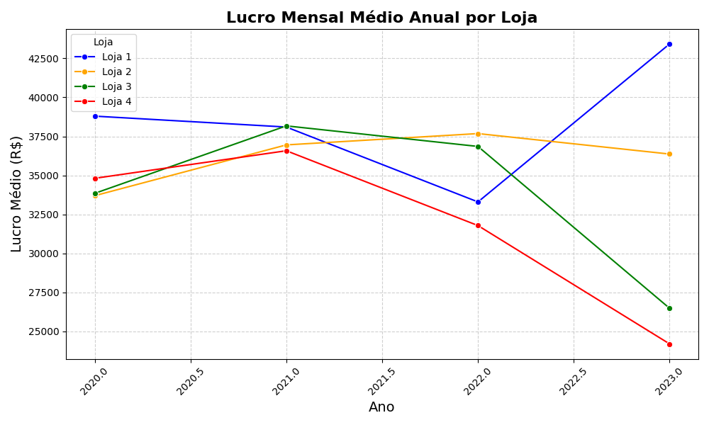
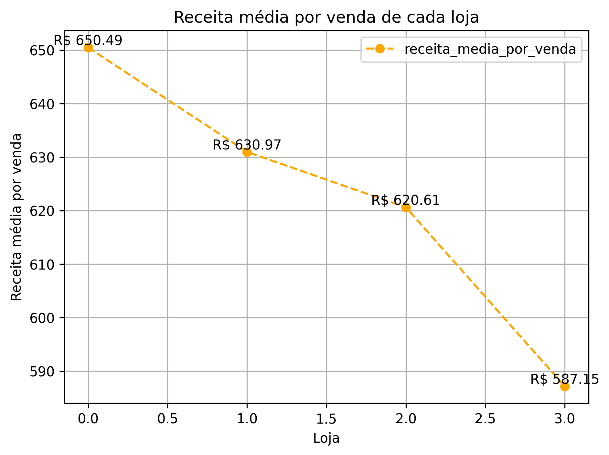

# Alura Store - Data analytics & insights strategist

## Visão geral do projeto
Este projeto de Análise Exploratória de Dados (EDA) foi desenvolvido para dar suporte à tomada de decisão executiva da rede Alura Store. O objetivo central foi processar a base de vendas, identificar padrões de consumo, avaliar custos logísticos e, por fim, recomendar estrategicamente o fechamento da unidade menos rentável da rede.

## Stack tecnológica
- **Python & Pandas**: Limpeza de dados nulos, manipulação de DataFrames e cálculo de KPIs (faturamento, ticket médio, rentabilidade).
- **Matplotlib & Seaborn**: Geração de visualizações estatísticas para data storytelling.
- **Google Colab**: Ambiente de prototipagem e documentação técnica.

## Resultados e recomendação estratégica
A análise verificou métricas de satisfação, volume de vendas por categoria (eletrônicos, móveis, brinquedos) e eficiência logística. O insight principal apontou a **loja 4** como o gargalo operacional da rede. 

Apesar de ter o frete médio mais baixo, a unidade falhou em converter essa vantagem em lucratividade, inclusive nas categorias de alta demanda. A decisão técnica pelo fechamento da loja 4 é sustentada principalmente por dois indicadores críticos:

### 1. Lucro mensal médio anual
O gráfico abaixo demonstra a consistência do baixo desempenho financeiro da loja 4 em comparação com as filiais concorrentes ao longo dos meses.

  

### 2. Receita média por venda
Aqui, comprovamos a ineficiência de conversão. O ticket médio da loja 4 opera muito abaixo do ponto de equilíbrio ideal da rede.

  

## Como explorar a análise
1. Clone este repositório.
2. Abra o arquivo `.ipynb` no [Google Colab](https://colab.research.google.com/).
3. Certifique-se de fazer o upload do dataset `AluraStoreBrasil.csv` no ambiente.
4. Execute as células para acompanhar a linha de raciocínio lógico e a geração dos gráficos.

---
> *Transparência e Vibe Coding: A análise de dados, lógica de programação e tomada de decisão estratégica apresentadas neste repositório são de minha autoria. A redação e formatação estrutural deste README foram otimizadas com auxílio de IA (Gemini), focando em agilidade e entrega profissional.*
