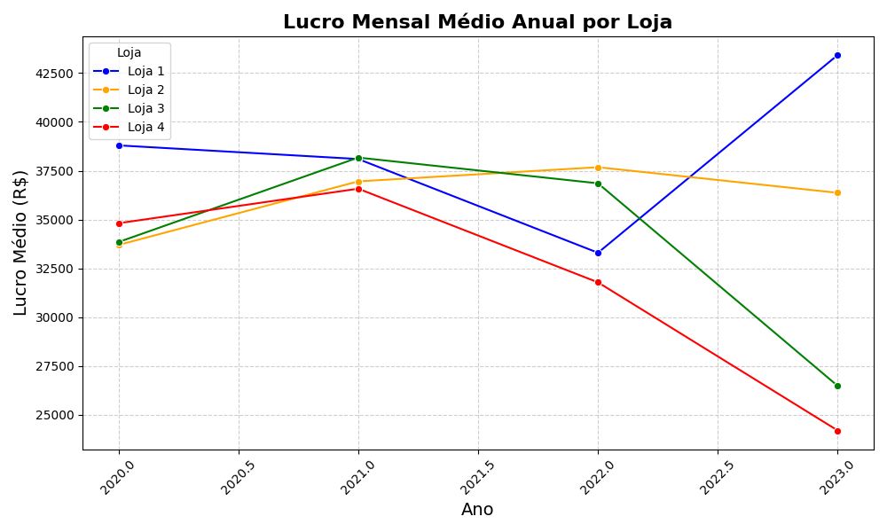

# Alura Store - Data analytics & insights strategist

### 👩‍💻 Sobre a Autora / About the Author
**Lidi Moura** | Arquiteta de Soluções & Especialista em Dados
* 🎓 **Especialista em Data Science** pelo programa ONE (Alura/Oracle).
* 🤖 **Especialista em IA** em formação (Alura/Santander).
* 📜 **Em preparação para certificações internacionais:** OCI (Oracle Cloud Infrastructure) e MySQL.
* [LinkedIn](https://linkedin.com/in/lidimoura) | [GitHub](https://github.com/lidimoura)

---

### 📂 Entregas do Projeto / Project Deliverables

Para garantir a transparência técnica e a facilidade na tomada de decisão, este projeto foi estruturado em duas frentes de entrega:

* 📊 **[Painel Executivo Interativo / Executive Dashboard (Streamlit)](https://alura-store-insights.streamlit.app/):** Desenvolvido para stakeholders e diretores. Foca exclusivamente em KPIs de negócios, impacto financeiro e na recomendação estratégica final, abstraindo a complexidade do código.

* 🛠️ **[Documentação Técnica e ETL / Deep Dive (GitHub Pages)](https://lidimoura.github.io/challenge1-data-science-Alura-Store/):** Recomendado para Tech Leads e recrutadores. Apresenta os bastidores da análise, detalhando todo o processo de Extração, Limpeza (ETL), tratamentos de dados e a lógica estatística construída no Google Colab.

---

## [PT-BR] Visão geral do projeto
Este projeto de Análise Exploratória de Dados (EDA) foi desenvolvido para dar suporte à tomada de decisão executiva da rede Alura Store. O objetivo central foi processar a base de vendas, identificar padrões de consumo, avaliar custos logísticos e, por fim, recomendar estrategicamente o fechamento da unidade menos rentável da rede.

## [EN] Project Overview
This project involves an Exploratory Data Analysis (EDA) developed to support executive decision-making for the Alura Store network. The primary objective was to process sales data, identify consumption patterns, evaluate logistics costs, and strategically recommend the decommissioning of the network's least profitable unit.

---

## Stack tecnológica
- **Python & Pandas**: Limpeza de dados nulos, manipulação de DataFrames e cálculo de KPIs (faturamento, ticket médio, rentabilidade).
- **Matplotlib & Seaborn**: Geração de visualizações estatísticas para data storytelling.
- **Plotly & Streamlit**: Dashboards interativos e visualização dinâmica.
- **Google Colab**: Ambiente de prototipagem e documentação técnica.

## Resultados e recomendação estratégica
A análise verificou métricas de satisfação, volume de vendas por categoria e eficiência logística. O insight principal apontou a **loja 4** como o gargalo operacional da rede. 

### 1. Lucro mensal médio anual
O gráfico abaixo demonstra a consistência do baixo desempenho financeiro da loja 4 em comparação com as filiais concorrentes ao longo dos meses.

  

### 2. Receita média por venda
Aqui, comprovamos a ineficiência de conversão. O ticket médio da loja 4 opera muito abaixo do ponto de equilíbrio ideal da rede.

  

## Como explorar a análise
* Clone este repositório.
* Abra o arquivo `.ipynb` no Google Colab.
* Certifique-se de fazer o upload do dataset `AluraStoreBrasil.csv` no ambiente.
* Execute as células para acompanhar a linha de raciocínio lógico e a geração dos gráficos.

---
**Transparência e Vibe Coding:** A análise de dados, lógica de programação e tomada de decisão estratégica apresentadas neste repositório são de minha autoria. A redação e formatação estrutural deste README foram otimizadas com auxílio de IA (Gemini), focando em agilidade e entrega profissional. 🌱 *Reflorestando o Digital.*
